# Project Charm — How a Possession Flows

A plain-basketball map of one possession through the engine. Each box is a step; the
letter in parentheses is the engine's own name for that step (Roll A–M), so the chart
and the code line up. This is the **clean** view — the spine plus the meaningful
branches, with "what kind of turnover / foul" collapsed into single steps. Traced from
the resolver at commit `5050a6d…`.

```mermaid
flowchart TD
    %% ---- nodes ----
    START(["Possession begins"])
    A["Bring it up<br/>(A)"]
    J["Transition —<br/>run or settle?<br/>(J)"]
    B["Set the offense<br/>(B)"]
    E["Pick who attacks<br/>(vs. denial + coach's system)<br/>(E)"]
    F["Pressure on the ball<br/>(F)"]
    G["Where from —<br/>rim / short / mid / long / three<br/>(G)"]
    H{"Shot result<br/>(H)"}
    L["Free throws<br/>(L)"]
    M["Rebound the free throw<br/>(M)"]
    I["Rebound the miss<br/>(I)"]
    K["Offensive rebound<br/>(K)"]
    C["Turnover —<br/>what kind?<br/>(C)"]
    D["Foul —<br/>what kind? shoots?<br/>(D)"]
    SCORE(["Basket good"])
    OTHER(["Other team's ball"])

    %% ---- how a possession starts ----
    START -->|"inbound, bring it up"| A
    START -->|"off a steal or board"| J
    START -. "other team's backcourt TO" .-> B

    %% ---- the spine ----
    A -->|clean| B
    A -->|turnover| C
    A -->|foul| D

    J -->|"push (fast break)"| E
    J -->|settle| B

    B -->|"run something"| E
    B -->|turnover| C
    B -->|foul| D

    E --> F
    F -->|"gets a shot off"| G
    F -->|"coughs it up"| C
    F -->|"non-shooting foul"| D

    G --> H
    H -->|made| SCORE
    H -->|"and-1 / shooting foul"| L
    H -->|"miss or blocked"| I

    %% ---- free throws ----
    L -->|"all made"| SCORE
    L -->|"last one missed"| M

    %% ---- the glass ----
    I -->|"defense boards it"| OTHER
    I -->|"offense boards it"| K
    M -->|"defense boards it"| OTHER
    M -->|"offense boards it"| K

    K -->|putback| H
    K -->|"kick out, reset"| E
    K -->|foul| D
    K -->|"lose it (turnover)"| OTHER

    %% ---- bookkeeping steps ----
    C --> OTHER
    D -->|"shooting / bonus"| L
    D -->|"non-shooting"| B

    %% ---- possession ends, other team starts ----
    SCORE --> OTHER
    OTHER -. "next possession" .-> START

    %% ---- styles ----
    classDef start fill:#e8f5e9,stroke:#2e7d32,color:#1b5e20;
    classDef score fill:#c8e6c9,stroke:#2e7d32,color:#1b5e20;
    classDef over  fill:#eceff1,stroke:#546e7a,color:#263238;
    class START start
    class SCORE score
    class OTHER over
```

**Reading it**

- The **spine** runs down the middle: bring it up → set the offense → pick who attacks → pressure on the ball → shot location → shot result.
- A **turnover** can happen in three places — bringing it up, setting the offense, or under on-ball pressure (before any shot goes up); all three funnel into "what kind of turnover" (C), then the other team's ball. (A turnover on an offensive-rebound crash is already typed, so it skips C and is the other team's ball directly.)
- A **foul** funnels into "what kind, does it shoot" (D) → free throws, or the offense keeps it.
- A **miss or block** goes to the glass (I): the defense ends the possession, or the offense rebounds (K) and either puts it back up, resets, or fouls on the crash.
- The possession **ends** at a made basket, a defensive rebound, or a turnover — then the other team starts: a fast break off a steal or board (J), or a fresh bring-up (A).
- On an **and-1**, the basket already counts — the free throw (L) is the attached bonus, not a condition for the points. (Same for a fouled miss: the free throws are shot, but no field goal scored.)

(C) and (D) are bookkeeping steps — they decide *which* turnover or foul it was, not whether one happened.
